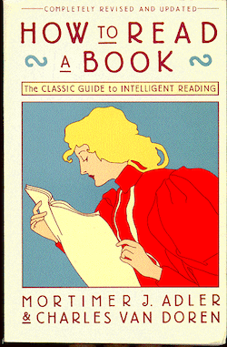

# How to Read a Book

> "...if we are disposed to go on learning and discovering, we must know how to make books teach us well. That, indeed, is the primary goal of this book." (pg. 17)

## Four levels of reading

### Elementary reading

The most basic level, where the primary aim is “to recognize the individual words on the page.”

### Inspectional reading

Time-limited reading where the primary aim is “to get the most out of a book with a given time.” Questions being asked: What‘s the book about? What is it's basic structure?” 

### Analytical reading

Close, active reading. "The best and most complete reading that is possible given unlimited time."

### Syntopical reading

Reading many books on the same subject and reaching conclusions that may not be in any of the individual books by comparing and relating them.

## Inspectional reading

### Stage 1: Skimming

#### Suggestions

1. Look at the title page and read the preface.
2. Study the table of contents.
3. Check the index. Look up some terms that seem crucial and read the corresponding passages.
4. Read the publisher's blurb.
5. Read the introductory and closing summaries of chapters that seem important.
6. Skim through the pages, reading a paragraph or two here and there (never more than a few pages in sequence).

#### Superficial reading

"In tackling a difficult book for the first time, read it through without ever stopping to look up or ponder the things you do not understand right away."